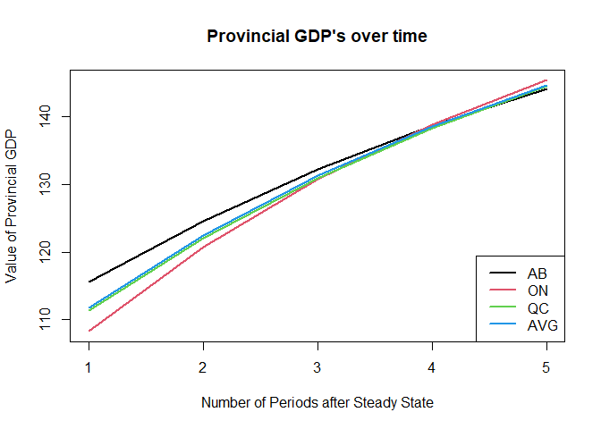
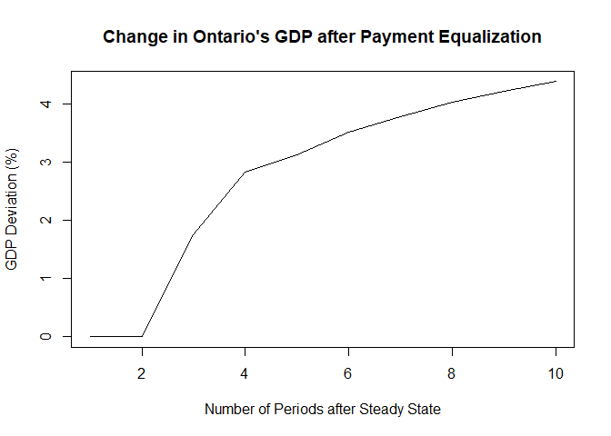
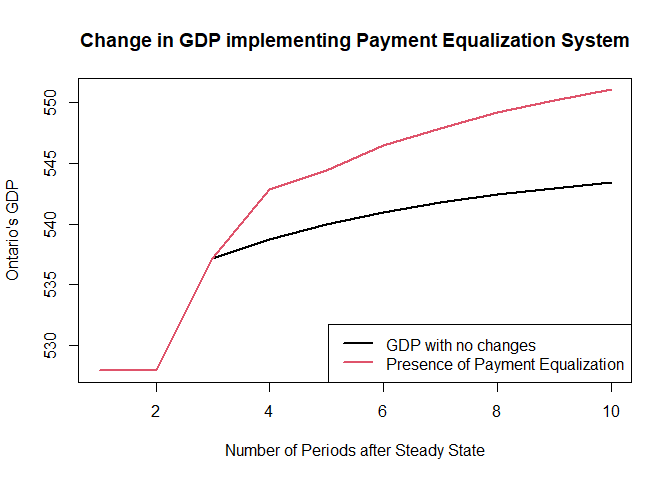
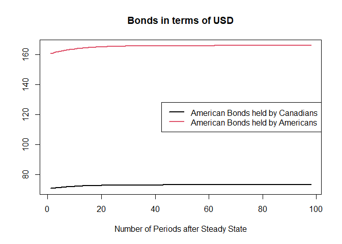
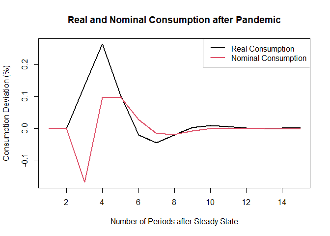

Input-Output Model Simulations
================
Sewon Chang
2023-12-20

Section 1.

The following interprovincial trade model is simulated involving
provinces Alberta, Ontario, and Quebec. Assume the federal government
operates an equalizing program that provides additional financial
support to provinces with a lower provincial GDP than the average
Canadian province.

``` r
library(sfcr)
library(cli)
library(htmltools)
library(fastmap)

reg_eqs <- sfcr_set(
Y_AB ~ C_AB + G_AB + X_AB - M_AB,
Y_ON ~ C_ON + G_ON + X_ON - M_ON,
Y_QC ~ C_QC + G_QC + X_QC - M_QC,
Y ~ Y_AB + Y_ON + Y_QC,
M_AB_ON ~ mu_AB_ON * Y_AB,
M_AB_QC ~ mu_AB_QC * Y_AB,
M_AB ~ M_AB_ON + M_AB_QC,
M_ON_AB ~ mu_ON_AB * Y_ON,
M_ON_QC ~ mu_ON_QC * Y_ON,
M_ON ~ M_ON_AB + M_ON_QC,
M_QC_AB ~ mu_QC_AB * Y_QC,
M_QC_ON ~ mu_QC_ON * Y_QC,
M_QC ~ M_QC_ON + M_QC_AB,
X_AB_ON ~ M_ON_AB,
X_AB_QC ~ M_QC_AB,
X_AB ~ X_AB_ON + X_AB_QC,
X_ON_AB ~ M_AB_ON,
X_ON_QC ~ M_QC_ON,
X_ON ~ X_ON_AB + X_ON_QC,
X_QC_AB ~ M_AB_QC,
X_QC_ON ~ M_ON_QC,
X_QC ~ X_QC_AB + X_QC_ON,
YD_AB ~ Y_AB - TX_AB + r[-1] * Bh_AB[-1] + EQZ_AB,
YD_ON ~ Y_ON - TX_ON + r[-1] * Bh_ON[-1] + EQZ_ON,
YD_QC ~ Y_QC - TX_QC + r[-1] * Bh_QC[-1] + EQZ_QC,
TX_AB ~ theta * ( Y_AB + r[-1] * Bh_AB[-1] ),
TX_ON ~ theta * ( Y_ON + r[-1] * Bh_ON[-1] ),
TX_QC ~ theta * ( Y_QC + r[-1] * Bh_QC[-1] ),
V_AB ~ V_AB[-1] + ( YD_AB - C_AB ),
V_ON ~ V_ON[-1] + ( YD_ON - C_ON ),
V_QC ~ V_QC[-1] + ( YD_QC - C_QC ),
C_AB ~ alpha1_AB * YD_AB + alpha2_AB * V_AB[-1],
C_ON ~ alpha1_ON * YD_ON + alpha2_ON * V_ON[-1],
C_QC ~ alpha1_QC * YD_QC + alpha2_QC * V_QC[-1],
Hh_AB ~ V_AB - Bh_AB,
Hh_ON ~ V_ON - Bh_ON,
Hh_QC ~ V_QC - Bh_QC,
Bh_AB ~ V_AB * ( lambda0_AB + lambda1_AB * r ),
Bh_ON ~ V_ON * ( lambda0_ON + lambda1_ON * r ),
Bh_QC ~ V_QC * ( lambda0_QC + lambda1_QC * r ),
TX ~ TX_AB + TX_ON + TX_QC,
G ~ G_AB + G_ON + G_QC,
Bh ~ Bh_AB + Bh_ON + Bh_QC,
Hh ~ Hh_AB + Hh_ON + Hh_QC,
Bs ~ Bs[-1] + ( G + EQZ_CA + r[-1] * Bs[-1] ) - ( TX + r[-1] * Bcb[-1] ),
Hs ~ Hs[-1] + Bcb - Bcb[-1],
Bcb ~ Bs - Bh,
AVGY ~ Y/3, # Moyenne Canadienne / Canadian Average
zeta_AB ~ if ( Y_AB[-1]-AVGY[-1] <0 ) {1} else {0},
zeta_ON ~ if ( Y_ON[-1]-AVGY[-1] <0 ) {1} else {0},
zeta_QC ~ if ( Y_QC[-1]-AVGY[-1] <0 ) {1} else {0},
EQZ_AB ~ -zeta_AB*rho_eqz*(Y_AB[-1]-AVGY[-1]),
EQZ_ON ~ -zeta_ON*rho_eqz*(Y_ON[-1]-AVGY[-1]),
EQZ_QC ~ -zeta_QC*rho_eqz*(Y_QC[-1]-AVGY[-1]),
EQZ_CA ~ EQZ_AB + EQZ_ON + EQZ_QC,
redondant ~ Hs - Hh
)

reg_ext <- sfcr_set(
r ~ 0.045,
G_AB ~ 50,
G_ON ~ 50,
G_QC ~ 50,
rho_eqz ~ 0,
mu_AB_ON ~ 0.2,
mu_AB_QC ~ 0.2,
mu_ON_AB ~ 0.2,
mu_ON_QC ~ 0.2,
mu_QC_AB ~ 0.2,
mu_QC_ON ~ 0.2,
alpha1_AB ~ 0.80,
alpha1_ON ~ 0.60,
alpha1_QC ~ 0.70,
alpha2_AB ~ 0.20,
alpha2_ON ~ 0.40,
alpha2_QC ~ 0.30,
lambda0_AB ~ 0.7,
lambda0_ON ~ 0.7,
lambda0_QC ~ 0.7,
lambda1_AB ~ 0.08,
lambda1_ON ~ 0.08,
lambda1_QC ~ 0.08,
theta ~ 0.30
)
```

Simulate the model for 100 periods

``` r
nper <- 100

model <- sfcr_baseline(
  equations = reg_eqs,
  external = reg_ext,
  periods = nper,
  method = "Broyden"
)
```

Below are the provincial GDPs at steady state:

``` r
model$Y_AB[nper]
```

    ## [1] 175.9733

``` r
model$Y_ON[nper]
```

    ## [1] 175.9733

``` r
model$Y_QC[nper]
```

    ## [1] 175.9733

The Total Canadian consumption is calculated by summing the provincial
consumptions (assuming we only consider the 3 mentioned provinces).

``` r
sum(model$C_AB[nper], model$C_ON[nper], model$C_QC[nper])
```

    ## [1] 377.9199

Suppose the Canadian Government decides to increase their spending and
help Alberta with a 10 percent increase in finance. Use function
sfcr_shock to implement this change and simulate graphically the impact
of this change.

``` r
knitr::opts_chunk$set(fig.path='Figs/')

shock_AB <- sfcr_shock(
  variables = sfcr_set(
    G_AB ~ 55
  ),
  start = 3,
  end = 50
)

shock_AB <- sfcr_scenario(
  baseline = model,
  scenario = shock_AB,
  periods = nper
)


ts.plot(100*(shock_AB$Y[1:10]/shock_AB$Y[1]-1),main="Deviation of Alberta's GDP from steady state",
        ylab ="GDP Deviation (%)", xlab = "Number of Periods after Steady State")
```

<!-- -->

Simulate the deviation of GDP from steady state of an increase to
Ontario, instead of Alberta.

``` r
shock_ON <- sfcr_shock(
  variables = sfcr_set(
    G_ON ~ 55
  ),
  start = 3,
  end = 50
)

shock_ON <- sfcr_scenario(
  baseline = model,
  scenario = shock_ON,
  periods = nper
)


ts.plot((100*(shock_ON$Y[1:10]/shock_ON$Y[1]-1)),main="Deviation of Ontario's GDP from steady state",
        ylab ="GDP Deviation (%)", xlab = 
          "Number of Periods after Steady State")
```

<!-- -->

Below is a comparison of the total GDP up to period 6 with both AB and
ON receiving a 10% financial increase in funds.

``` r
ts.plot(cbind(shock_AB[1:6,c("Y_AB")],shock_AB[1:6,c("Y_ON")]),main="GDP Comparison of Ontario and Alberta",col=1:2,lwd=2, xlab = "Number of Periods after Steady State", ylab = "Provincial GDP")
legend('bottomright',legend=c("Y_AB", "Y_ON"),col=1:4,lty=1,lwd=2)
```

<!-- -->

The provincial GDP is strictly related to the alpha1 variable as shown
in the provincial consumption equations. Since alpha1 of AB is greater
than ON, then an increase in Governmental spending will cause AB to have
greater GDP, even when the increase of the governmental expense is
exactly the same.

Graph of evolution of provincial GDP and average Canadian GDP (AVGY)
following the shock on Ontario’s funds.

``` r
ts.plot(cbind(model[3:7,c("Y_AB")],model[3:7,c("Y_ON")],model[3:7,c("Y_QC")],
              model[3:7,c("AVGY")]),main="Provincial GDP's over time",col=1:4,lwd=2, xlab = "Number of Periods after Steady State", ylab = "Value of Provincial GDP")
legend('bottomright',legend=c("AB", "ON", "QC", "AVG"),col=1:4,lty=1,lwd=2)
```

<!-- -->

The Quebec GDP is barely below the average so it could use a very small
payment of equalization. Ontario is significantly more below the average
so it should receive an increase in funds to reach a more equal GDP to
the other provinces.

Note that variable Rho_eqz is the parameter that decides the magnitude
of the equalization payment when the provincial GDP is underperforming
compared to the average.

Suppose variable Rho_eqz takes the value of 1. We set up a shock and
simulate:

``` r
shock_rho <- sfcr_shock(
  variables = sfcr_set(
    G_ON ~ 55,
    rho_eqz ~ 1
  ),
  start = 3,
  end = 50
)

shock_rho <- sfcr_scenario(
  baseline = model,
  scenario = shock_rho,
  periods = nper
)

ts.plot((100*(shock_rho$Y[1:10]/shock_rho$Y[1]-1)),main="Change in Ontario's GDP after Payment Equalization", ylab ="GDP Deviation (%)", xlab = 
          "Number of Periods after Steady State")
```

<!-- -->

Notice that a positive value of variable Rho_eqz causes an increase of
over 4% in GDP over the course of 10 periods for Ontario.

Observe the impact of the payments of equalization on Ontario’s GDP in
the first 10 periods:

``` r
ts.plot(cbind(shock_ON[1:10,c("Y")],shock_rho[1:10,c("Y")]),main="Change in GDP implementing Payment Equalization System",col=1:2,lwd=2, xlab = "Number of Periods after Steady State", ylab = "Ontario's GDP")
legend('bottomright',legend=c("GDP with no changes", "Presence of Payment Equalization"),col=1:4,lty=1,lwd=2)
```

<!-- -->

There is an evident increase in the total Canadian GDP after
implementing variable rho-eqz. This is due to Ontario’s GDP being lower
than the average and hence it is supported by the government which will
increase it’s GDP, leading to an overall increase in the Canadian GDP.

Section 2.

The following is an international trade model between Canada and the
United States. Suppose that in this model, both Canadian American
households are able to purchase bonds from the Canadian government.

``` r
rm(list=ls())

open_eqs <- sfcr_set(
eq1 = Y_CA ~ C_CA + G_CA + X_CA - M_CA,
eq2 = Y_US ~ C_US + G_US + X_US - M_US,
eq3 = M_CA ~ mu_CA * Y_CA,
eq4 = M_US ~ mu_US * Y_US,
eq5 = X_CA ~ M_US / xr,
eq6 = X_US ~ M_CA * xr,
eq7 = YD_CA ~ Y_CA + r_CA[-1] * Bh_CA_CA[-1] + r_US[-1] * Bs_CA_US[-1] / xr - TX_CA,
eq8 = YD_US ~ Y_US + r_CA[-1] * Bs_US_CA[-1] * xr + r_US[-1] * Bh_US_US[-1] - TX_US,
eq9 = TX_CA ~ theta_CA * ( Y_CA + r_CA[-1] * Bh_CA_CA[-1] + r_US[-1] * Bs_CA_US[-1] / xr ),
eq10 = TX_US ~ theta_US * ( Y_US + r_CA[-1] * Bs_US_CA[-1] * xr + r_US[-1] * Bh_US_US[-1] ),
eq11 = CG_CA ~ Bs_CA_US[-1] * (1/xr - 1/xr[-1]),
eq12 = CG_US ~ Bs_US_CA[-1] * (xr - xr[-1]),
eq13 = V_CA ~ V_CA[-1] + ( YD_CA - C_CA ) + CG_CA,
eq14 = V_US ~ V_US[-1] + ( YD_US - C_US ) + CG_US,
eq15 = C_CA ~ alpha1_CA * YD_CA + alpha2_CA * V_CA[-1],
eq16 = C_US ~ alpha1_US * YD_US + alpha2_US * V_US[-1],
eq17 = Hh_CA ~ V_CA - Bh_CA_CA - Bh_CA_US,
eq18 = Hh_US ~ V_US - Bh_US_CA - Bh_US_US,
eq19 = Bh_CA_CA ~ V_CA * ( lambda20_CA + lambda22_CA * r_CA + lambda23_CA * r_US ),
eq20 = Bh_CA_US ~ V_CA * ( lambda30_CA + lambda32_CA * r_CA + lambda33_CA * r_US ),
eq21 = Bh_US_CA ~ V_US * ( lambda20_US + lambda22_US * r_CA + lambda23_US * r_US ),
eq22 = Bh_US_US ~ V_US * ( lambda30_US + lambda32_US * r_CA + lambda33_US * r_US ),
eq23 = Bs_CA ~ Bs_CA[-1] + ( G_CA + r_CA[-1] * Bs_CA[-1] ) - ( TX_CA + r_CA[-1] * Bcb_CA[-1] ),
eq24 = Bs_US ~ Bs_US[-1] + ( G_US + r_US[-1] * Bs_US[-1] ) - ( TX_US + r_US[-1] * Bcb_US[-1] ),
eq25 = Bs_CA_US ~ Bh_CA_US * xr,
eq26 = Bs_US_CA ~ Bh_US_CA / xr,
eq27 = Bcb_CA ~ Bs_CA - Bh_CA_CA - Bs_US_CA,
eq28 = Bcb_US ~ Bs_US - Bs_CA_US - Bh_US_US,
eq29 = or_CA ~ or_CA[-1] + ( Hs_CA - Hs_CA[-1] - ( Bcb_CA - Bcb_CA[-1] ) )/pg_CA,
eq30 = or_US ~ or_US[-1] + ( Hs_US - Hs_US[-1] - ( Bcb_US - Bcb_US[-1] ) )/pg_US,
eq31 = Hs_CA ~ Hh_CA,
eq32 = Hs_US ~ Hh_US,
eq33 = xr ~ pg_US / pg_CA,
eq34 = deltaor_US ~ or_US - or_US[-1],
eq35 = deltaor_CA ~ or_CA - or_CA[-1],
eq36 = CAB_CA ~ X_CA - M_CA + r_US[-1] * Bs_CA_US[-1] * xr - r_CA[-1] * Bs_US_CA[-1],
eq37 = CAB_US ~ X_US - M_US - r_US[-1] * Bs_CA_US[-1] + r_CA[-1] * Bs_US_CA[-1] / xr,
eq38 = FAB_CA ~ -(deltaor_CA*pg_CA + (Bs_CA_US - Bs_CA_US[-1])*xr - (Bs_US_CA - Bs_US_CA[-1])),
eq39 = FAB_US ~ -(deltaor_US*pg_US + (Bs_US_CA - Bh_US_CA[-1])/xr - (Bs_CA_US - Bh_CA_US[-1])),
eq40 = BOP_CA ~ CAB_CA + FAB_CA,
eq41 = BOP_US ~ CAB_US + FAB_US,
eq42 = GDEF_CA ~ -(Bs_CA - Bs_CA[-1]),
eq43 = GDEF_US ~ -(Bs_US - Bs_US[-1]),
eq44 = redondant ~ deltaor_US + deltaor_CA
)


open_ext <- sfcr_set(
pg_CA ~ 1.0,
pg_US ~ 1.0,
r_CA ~ 0.04,
r_US ~ 0.04,
orbar_CA ~ 100,
orbar_US ~ 100,
G_US ~ 50,
G_CA ~ 50,
mu_CA ~ 0.15,
mu_US ~ 0.15,
alpha1_CA ~ 0.8,
alpha1_US ~ 0.8,
alpha2_CA ~ 0.2,
alpha2_US ~ 0.2,
lambda20_CA ~ 0.55,
lambda30_CA ~ 0.25,
lambda20_US ~ 0.25,
lambda30_US ~ 0.55,
lambda22_CA ~ 5,
lambda23_CA ~ -3,
lambda32_CA ~ -3,
lambda33_CA ~ 5,
lambda22_US ~ 5,
lambda23_US ~ -3,
lambda32_US ~ -3,
lambda33_US ~ 5,
theta_CA ~ 0.2,
theta_US ~ 0.2,
)
open_initial <- sfcr_set(
xr ~ 1,
or_CA ~ 100,
or_US ~ 100
)
```

200 periods are simulated for this model.

``` r
nper <- 200

model2 <- sfcr_baseline(
  equations = open_eqs,
  external = open_ext,
  periods = nper,
  method = "Broyden"
)

model2$Y_CA[nper]
```

    ## [1] 286.2949

``` r
model2$Y_US[nper]
```

    ## [1] 286.2949

Notice that the Xr exchange rate is expressed as the number of American
dollars necessary to buy one Canadian dollar. This is because in the
equations, an amount expressed in American dollars would divide into xr
and an amount in CAD would multiply into xr.

Furthermore, Lambda20_CA and Lambda 30_CA are the direct impact of
Canadian and American households on the Canadian government bonds,
respectively.

Similarly, Lambda20_US and Lambda 30_US are the direct impact of the
Canadian and American households on the American government bonds,
respectively. Hence, these values are lower than their Canadian
counterparts.

The share of wealth (%) that Canadian households hold at steady state
in 1) Canadian Treasury bills, 2) US treasury bills and 3) currency is
calculated.

``` r
model2$Bh_CA_CA[nper]/model2$V_CA[nper]
```

    ## [1] 0.63

``` r
model2$Bh_CA_US[nper]/model2$V_CA[nper]
```

    ## [1] 0.33

``` r
model2$Hh_CA[nper]/model2$V_CA[nper]
```

    ## [1] 0.04

The same is done for American households.

``` r
model2$Bh_US_CA[nper]/model2$V_US[nper]
```

    ## [1] 0.33

``` r
model2$Bh_US_US[nper]/model2$V_US[nper]
```

    ## [1] 0.63

``` r
model2$Hh_US[nper]/model2$V_US[nper]
```

    ## [1] 0.04

Observe that the parts of the bonds of Canadian and American are
reversed while variable Hh is the same. This proves that these values
are correct as they are exchange rates

Suppose the American central bank increases the key rate from 4% to 5%.
This new model is simulated:

``` r
shock_rUS <- sfcr_shock(
  variables = sfcr_set(
    r_US ~ 0.05
  ),
  start = 3,
  end = 100
)

shock_rUS <- sfcr_scenario(
  baseline = model2,
  scenario = shock_rUS,
  periods = nper
)
```

Below is the evolution of consumption in Canada and USA following the
shock implemented above.

``` r
ts.plot(cbind((100*(shock_rUS$C_CA[3:60]/shock_rUS$C_CA[1]-1)),(100*
        (shock_rUS$C_US[3:60]/shock_rUS$C_US[1]-1))),main="Canada and USA Consumption levels",col=1:2,lwd=2, xlab = "Number of Periods after Steady State", ylab = "Consumption Deviation (%)")
legend('bottomright',legend=c("C_CA", "C_US"),col=1:2,lty=1,lwd=2)
```

<!-- -->

Given the new shock, it is evident that the Consumption in Canada
increases and reaches a steady state of over 3% while USA of around
2.5%. Canada is the clear winner here from this change.

Variables Bh_CA_CA and Bh_CA_US are plotted in the same graph, variables
Bh_US_CA et Bh_US_US in a separate graph. \*Bh = bonds held

``` r
ts.plot(cbind(shock_rUS[3:100,c("Bh_CA_CA")],shock_rUS[3:100,c("Bh_CA_US")]),
        main="Bonds in terms of CAD",col=1:2,lwd=2, xlab = "Number of Periods after Steady State")
legend('right',legend=c("Canadian Bonds held by Canadians", "Canadian Bonds held by Americans"),col=1:2,lty=1,lwd=2)
```

<!-- -->

``` r
ts.plot(cbind(shock_rUS[3:100,c("Bh_US_CA")],shock_rUS[3:100,c("Bh_US_US")]),
        main="Bonds in terms of USD",col=1:2,lwd=2, xlab = "Number of Periods after Steady State")
legend('right',legend=c("American Bonds held by Canadians", "American Bonds held by Americans"),col=1:2,lty=1,lwd=2)
```

<!-- -->

Observe that households holding their bonds of their own country have
the highest demand. Households of one country holding bonds of another
have relatively low demand, in comparison.

Suppose the direct impacts of the households on the bonds are all set to
be equal at 0.4. We implement this new shock:

``` r
shock_alt <- sfcr_shock(
  variables = sfcr_set(
    lambda20_CA ~ 0.4,
    lambda30_CA ~ 0.4,
    lambda20_US ~ 0.4,
    lambda30_US ~ 0.4,
  ),
  start = 0,
  end = 200
)

shock_alt <- sfcr_scenario(
  baseline = model2,
  scenario = shock_alt,
  periods = nper
)
```

We simulate this new model for 200 periods:

Canadian households in alternative model”

``` r
shock_alt$Bh_CA_CA[nper]/shock_alt$V_CA[nper]
```

    ## [1] 0.48

``` r
shock_alt$Bh_CA_US[nper]/shock_alt$V_CA[nper]
```

    ## [1] 0.48

``` r
shock_alt$Hh_CA[nper]/shock_alt$V_CA[nper]
```

    ## [1] 0.04

American households in alternative model:

``` r
shock_alt$Bh_US_CA[nper]/shock_alt$V_US[nper]
```

    ## [1] 0.48

``` r
shock_alt$Bh_US_US[nper]/shock_alt$V_US[nper]
```

    ## [1] 0.48

``` r
shock_alt$Hh_US[nper]/shock_alt$V_US[nper]
```

    ## [1] 0.04

Notice that the distributions between Canadian and American bonds are
the exact same for both households.

Compute for variables Y_CA and Y_US at steady state in this model.

``` r
shock_alt$Y_CA[nper]
```

    ## [1] 286.2949

``` r
shock_alt$Y_US[nper]
```

    ## [1] 286.2949

The equalization payments are exactly the same at 286.2949. This means
that no matter how the lamda variables are changed, as long as the sum
of variables lambda20 and lambda30 are equal, the equalization payments
will always stay the same at 286.2949.

Now, combine both the model where the key rate was increased to 5%, in
addition to the alternative model setting all lambda variables to 0.4.
Simulate:

``` r
shock_i <- sfcr_shock(
  variables = sfcr_set(
    r_US ~ 0.05,
    lambda20_CA ~ 0.4,
    lambda30_CA ~ 0.4,
    lambda20_US ~ 0.4,
    lambda30_US ~ 0.4
  ),
  start = 3,
  end = 100
)

shock_i <- sfcr_scenario(
  baseline = model2,
  scenario = shock_i,
  periods = nper
)
```

Graph the evolution of consumption in Canada due to the shock, in both
the initial and alternative models.

``` r
ts.plot(cbind((100*(shock_i$C_CA[1:100]/shock_i$C_CA[1]-1)),(100*(model2$C_CA[1:100]
/model2$C_CA[1]-1))),main="Canada Consumption of initial and alternative models",col=1:2,lwd=2, xlab = "Number of Periods after Steady State", ylab ="Consumption Deviation (%)")
legend('right',legend=c("C with shock", "Original C"),col=1:2,lty=1,lwd=2)
```

<!-- -->

Even though the GDP stays the same in the alternative model, consumption
is vastly different with the changes. The original consumption is almost
negligible compared to the consumption with the new changes. The USA key
rate is directly associated with the government bonds that are expressed
in USD. It is positively correlated to Production so as r_US increased,
so did Y which in turn increased the level of consumption. The changes
in lambda could also contribute the increase in consumption as they are
also directly involved with the values of the government bonds.

Section 3.

Lastly, we simulate a model involving real and nominal variables, price
inflation and salaries:

``` r
rm(list=ls())

pc_eqs <- sfcr_set(
  Y ~ C + G,
  YD ~ Y - T + r[-1] * Bh[-1],
  T ~ theta * (Y + r[-1] * Bh[-1]),
  V ~  V[-1] + (YD - C), 
  C ~ alpha1 * YD + alpha2 * V[-1],
  Hh ~ V - Bh,
  Bh ~ V * (lambda0 + lambda1 * r - lambda2 * ( YD/V )),
  Bs ~ Bs[-1] + (G + r[-1] * Bs[-1]) - (T + r[-1] * Bcb[-1]),
  Hs ~ Hs[-1] + Bcb - Bcb[-1],
  Bcb ~ Bs - Bh,
  redondant ~ Hs - Hh 
)

pc_exog <- sfcr_set(
  r ~ 0.025,
  G ~ 20,
  alpha1 ~ 0.8, 
  alpha2 ~ 0.2, 
  theta ~ 0.2,  
  lambda0 ~ 0.635, 
  lambda1 ~ 5, 
  lambda2 ~ 0.01 
)

nper <- 200

pcbase <- sfcr_baseline(
  equations = pc_eqs, 
  external = pc_exog, 
  periods = nper,
  method = "Broyden"
)

pcnom_eqs <- sfcr_set(
  eq1 = Y ~ C + G, 
  eq2 = Yn ~ Y * P,
  eq3 = N ~ Y / prod,
  eq4 = W ~ xi_w*W[-1] + (1-xi_w)*(w0 + w1*(exp(100*(N/N_fe-1))-1)),
  eq5 = Wn ~ W*P,
  eq6 = WB ~ Wn * N,
  eq7 = Profits ~ Yn - WB,
  eq8 = UCn ~ WB / Y,
  eq9 = P ~ xi_p*P[-1]+(1-xi_p)*(1+markup)*UCn,
  eq10 = Pi ~ (P/P[-1]-1),
  eq11 = YDn ~ WB + Profits + r[-1] * Bh[-1] - TX,
  eq12 = YD ~ YDn / P,
  eq13 = TX ~ theta * (WB + Profits + r[-1] * Bh[-1]),
  eq14 = Vn ~ Vn[-1] + YDn - Cn,
  eq15 = V ~ Vn / P,
  eq16 = C ~ alpha1 * YD + alpha2 * V[-1],
  eq17 = Cn ~ C * P,
  eq18 = Hh ~ Vn - Bh,
  eq19 = Bh ~ Vn * (lambda0 + lambda1 * r - lambda2 * ( YDn/Vn )),
  eq20 = Bs ~ Bs[-1] + (Gn + r[-1] * Bs[-1]) - (TX + r[-1] * Bcb[-1]),
  eq21 = G ~ Gn / P,
  eq22 = Hs ~ Hs[-1] + Bcb - Bcb[-1],
  eq23 = Bcb ~ Bs - Bh,
  eq24 = r ~ rbar,
  eq25 = redondant ~ Hs - Hh 
)

nper <- 200 

pcnom_exog <- sfcr_set(
  prod ~ 1,
  N_fe ~ pcbase$Y[200],
  markup ~ 0.1,
  
  w0 ~ 1/1.1,
  w1 ~ 0.01,
  
  rbar ~ 0.025,
  Gn ~ 20,
  theta ~ 0.2,  

  alpha1 ~ 0.8, 
  alpha2 ~ 0.2, 

  lambda0 ~ 0.635, 
  lambda1 ~ 5, 
  lambda2 ~ 0.01,

  xi_p ~ 0.5,
  xi_w ~ 0.5
)


pcnom_initval <- sfcr_set(
  P ~ 1,    
  Pi ~ 0,
  Y ~ pcbase$Y[nper], 
  Yn ~ pcbase$Y[nper],
  N ~ pcbase$Y[nper],
  W ~ 1/1.1,
  Wn ~ 1/1.1,
  WB ~ pcbase$Y[nper]/1.1,
  Profits ~ pcbase$Y[nper] - pcbase$Y[nper]/1.1,
  UCn ~ 1/1.1,
  YDn ~ pcbase$YD[nper],
  YD ~ pcbase$YD[nper],
  TX ~ pcbase$T[nper], 
  Vn ~ pcbase$V[nper],
  V ~ pcbase$V[nper],
  C ~ pcbase$C[nper], 
  Cn ~ pcbase$C[nper],
  Hh ~ pcbase$Hh[nper],
  Bh ~ pcbase$Bh[nper],
  Bs ~ pcbase$Bs[nper],
  G ~ pcbase$G[nper],
  Hs ~ pcbase$Hs[nper],
  Bcb ~ pcbase$Bcb[nper],
  r ~ 0.025,
  redondant ~ 0 
)

pcnom <- sfcr_baseline(
  equations = pcnom_eqs, 
  external = pcnom_exog, 
  initial = pcnom_initval,
  periods = nper,
  method = "Broyden"
)

pcfisc_eqs <- sfcr_set(
  eq1 = Y ~ C + G, 
  eq2 = Yn ~ Y * P,
  eq3 = N ~ Y / prod,
  eq4 = W ~ xi_w*W[-1] + (1-xi_w)*(w0 + w1*(exp(100*(N/N_fe-1))-1)),
  eq5 = Wn ~ W*P,
  eq6 = WB ~ Wn * N,
  eq7 = Profits ~ Yn - WB,
  eq8 = UCn ~ WB / Y,
  eq9 = P ~ xi_p*P[-1]+(1-xi_p)*(1+markup)*UCn,
  eq10 = Pi ~ (P/P[-1]-1),
  eq11 = YDn ~ WB + Profits + r[-1] * Bh[-1] - TX,
  eq12 = YD ~ YDn / P,
  eq13 = TX ~ theta * (WB + Profits + r[-1] * Bh[-1]),
  eq14 = Vn ~ Vn[-1] + YDn - Cn,
  eq15 = V ~ Vn / P,
  eq16 = C ~ alpha1 * YD + alpha2 * V[-1],
  eq17 = Cn ~ C * P,
  eq18 = Hh ~ Vn - Bh,
  eq19 = Bh ~ Vn * (lambda0 + lambda1 * r - lambda2 * ( YDn/Vn )),
  eq20 = Bs ~ Bs[-1] + (Gn + r[-1] * Bs[-1]) - (TX + r[-1] * Bcb[-1]),
  eq21 = Gn ~ (1-fiscsw)*((1-rhog)*Gnbar + rhog*Gn[-1]) + fiscsw*(Gnbar+e_gn),
  eq22 = G ~ Gn / P,
  eq23 = Hs ~ Hs[-1] + Bcb - Bcb[-1],
  eq24 = Bcb ~ Bs - Bh,
  eq25 = r ~ rbar,
  eq26 = redondant ~ Hs - Hh,
)

nper <- 200 

pcfisc_exog <- sfcr_set(
  pcnom_exog,
  e_gn ~ 0,
  rhog ~ 0.5,
  Gnbar ~ pcnom$Gn[nper],
  fiscsw ~ 0,
  exclude = 7
)

pcfisc_initval <- sfcr_set(
  pcnom_initval,
  Gn ~ pcnom$Gn[nper]
)

pcfisc <- sfcr_baseline(
  equations = pcfisc_eqs, 
  external = pcfisc_exog, 
  initial = pcfisc_initval,
  periods = nper,
  method = "Broyden"
)
```

Note that price stickiness is represented by variable xi_p and for wage
is xi_w. Both are set to 0.5 in this model, hence we can assume we are
working with the presence of both.

Suppose an increase of productivity (variable prod) of 1%. Simulate 100
periods of the new model:

``` r
shock_p <- sfcr_shock(
  variables = sfcr_set(
    prod ~ 1.01
  ),
  start = 3,
  end = 100
)

shock_p <- sfcr_scenario(
  baseline = pcfisc,
  scenario = shock_p,
  periods = nper
)

ts.plot(100*(shock_p$P[1:15]/shock_p$P[1]-1),main="Evolution of new Price Levels", ylab
        ="Price Level Deviation (%)", xlab = "Number of Periods after Steady State")
```

<!-- -->

On the same graph, trace the evolution of real wage, nominal wage, and
unit cost of production.

``` r
ts.plot(cbind((100*(shock_p$W[1:10]/shock_p$W[1]-1)), (100*(shock_p$Wn[1:10]/
shock_p$Wn[1]-1)), (100*(shock_p$UCn[1:10]/shock_p$UCn[1]-1))),ylim=c(-2.5,2.5),col=1:3,lwd=2, xlab = "Number of Periods after Steady State", ylab ="Deviation (%)")
title(main="Deviation of Marginal Cost of Production, Real, and Nominal Wages", adj=0, line = 1, font.main = 1)
legend("top",legend=c("Real Wages", "Nominal Wages", "Marginal cost of
production"), col=1:3, lty=1,lwd=2, cex=0.8, ncol=3)
```

<!-- -->

Observe that the price levels reach steady state a lot quicker with the
price level being negative from the first graph. There is also no
exponential growth of the price levels which would be present without an
increasing production

Plot the evolution of real consumption and nominal consumption:

``` r
ts.plot(cbind((100*(shock_p$C[1:10]/shock_p$C[1]-1)), (100*(shock_p$Cn[1:10]/
shock_p$Cn[1]-1))),ylim=c(-2,2),col=1:2,lwd=2, xlab = "Number of Periods after Steady State", ylab = "Deviation (%)")
title(main="Deviation of Marginal Cost of Production, Real, and Nominal Wages", adj=0, line = 1, font.main = 1)
legend('bottomright',legend=c("Real Consumption", "Nominal Consumption"),col=1:2,lty=1,lwd=2)
```

<!-- -->

Conclude that increased production contributes to improving standard of
living in households. There is a clear increase in the real consumption
compared to the nominal consumption at the beginning periods and when
both reach steady state, real consumption is positive whilst nominal is
at 0.

Now suppose that a 1% increase in productivity occurs at the same time
as a pandemic decimates the economy’s labor force, such that the level
of full employment (N_fe), drops to 1.625%.

This shock is implemented and simulated for 100 periods:

``` r
shock_N <- sfcr_shock(
  variables = sfcr_set(
    prod ~ 1.01,
    N_fe ~ 0.98375*pcbase$Y[200]
  ),
  start = 3,
  end = 100
)

shock_N <- sfcr_scenario(
  baseline = pcfisc,
  scenario = shock_N,
  periods = nper
)


ts.plot(cbind((100*(shock_N$P[1:10]/shock_N$P[1]-1)),(100*(shock_p$P[1:10]/
        shock_p$P[1]-1))), ylim=c(-2,2),col=1:2,lwd=2, ylab
        ="Price Levels Deviation (%)", xlab = "Number of Periods after Steady State")
title(main="Price levels Deviation after Pandemic")
legend('topright',legend=c("Price levels with Pandemic", "Price level with only production inc"),col=1:2,lty=1,lwd=2)
```

<!-- -->

The price levels naturally increase after the pandemic since jobs lost
mean firms want to keep production and so increase prices, there will be
shortages of goods which also increases the price, etc.

Finally, plot the evolution of real and nominal consumption following
the above shock.

``` r
ts.plot(cbind((100*(shock_N$C[1:15]/shock_N$C[1]-1)),(100*(shock_N$Cn[1:15]/
        shock_N$Cn[1]-1))),main="Real and Nominal Consumption after Pandemic",col=1:2,lwd=2, ylab
        ="Consumption Deviation (%)", xlab = "Number of Periods after Steady State")
legend('topright',legend=c("Real Consumption", "Nominal Consumption"),col=1:2,lty=1,lwd=2)
```

<!-- -->

The big difference is at around period 3 where real consumption spikes
up but nominal consumption will spike down. This is because real
consumption will take into consideration the changes in price levels
from the pandemic. We saw that the price levels increase which also
causing the real consumption to spike. In the steady state however,
these two will once again merge.
